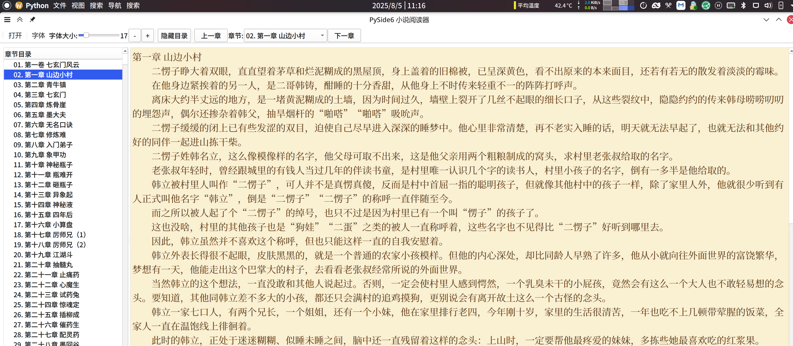

# PySide6 小说阅读器

一个简单的功能完整的TXT文本小说阅读器，使用 PySide6 开发。

## 功能特性

### 📚 基本功能
- **打开文本文件**: 
  - 智能编码检测，支持 UTF-8、GBK、GB2312、Big5 等多种编码
  - 手动编码选择，确保文件正确打开
  - 容错机制，避免因编码问题导致的打开失败
- **自动章节解析**: 智能识别章节标题，支持多种章节标题格式
- **智能章节导航**: 
  - 左侧章节列表，可点击跳转到任意章节
  - 自动章节跳转：在章节末尾滚轮或按键自动跳转到下一章
  - 快捷键导航：Ctrl+方向键快速切换章节
  - 工具栏按钮：上一章/下一章按钮

### 🎨 界面自定义
- **完整字体设置**: 
  - 通过菜单栏或工具栏访问字体对话框
  - 支持字体类型、大小、粗体、斜体等完整设置
  - 实时预览字体效果
- **字体大小调节**: 
  - 工具栏滑块实时调节字体大小（8-72号）
  - 快捷按钮（+/-）快速调整字体大小
  - 菜单栏预设字体大小快速选择
- **颜色自定义**: 
  - 自定义阅读区域背景颜色
  - 自定义文字颜色
  - 实时颜色预览和反馈
- **预设主题**: 
  - 默认主题（白底黑字）
  - 护眼深色主题（深灰底浅色字）
  - 护眼米黄主题（米黄底深棕字）
- **界面布局**: 
  - 侧边栏显示/隐藏切换（F9键）
  - 灵活的阅读区域大小调整
  - 专注阅读模式支持
- **设置持久化**: 自动保存和恢复用户所有自定义设置

